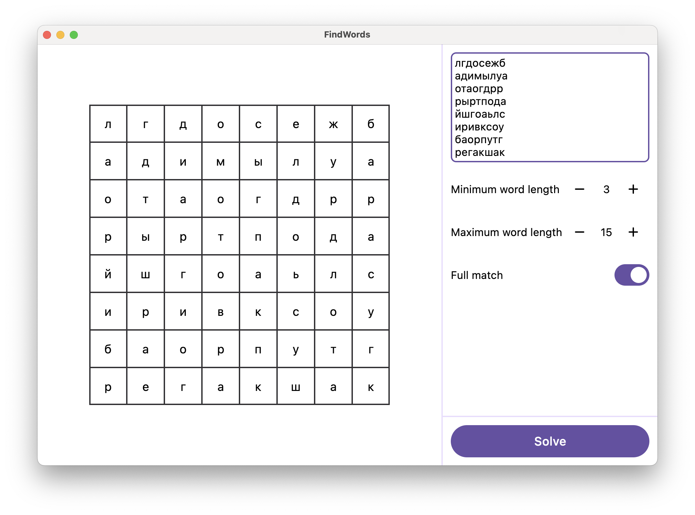
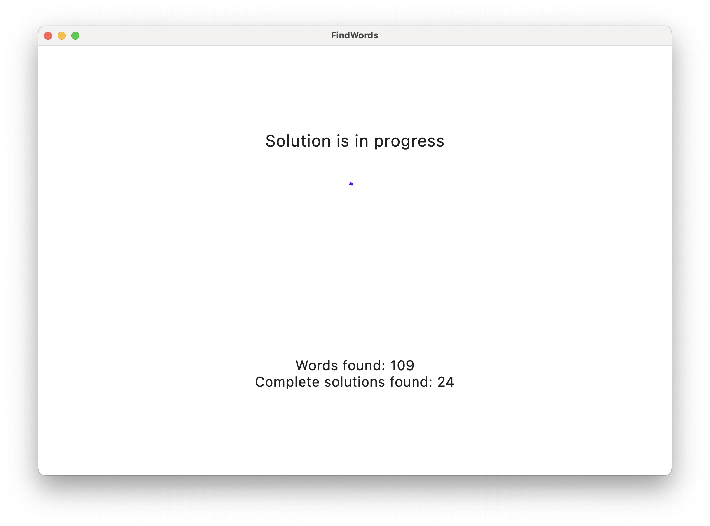
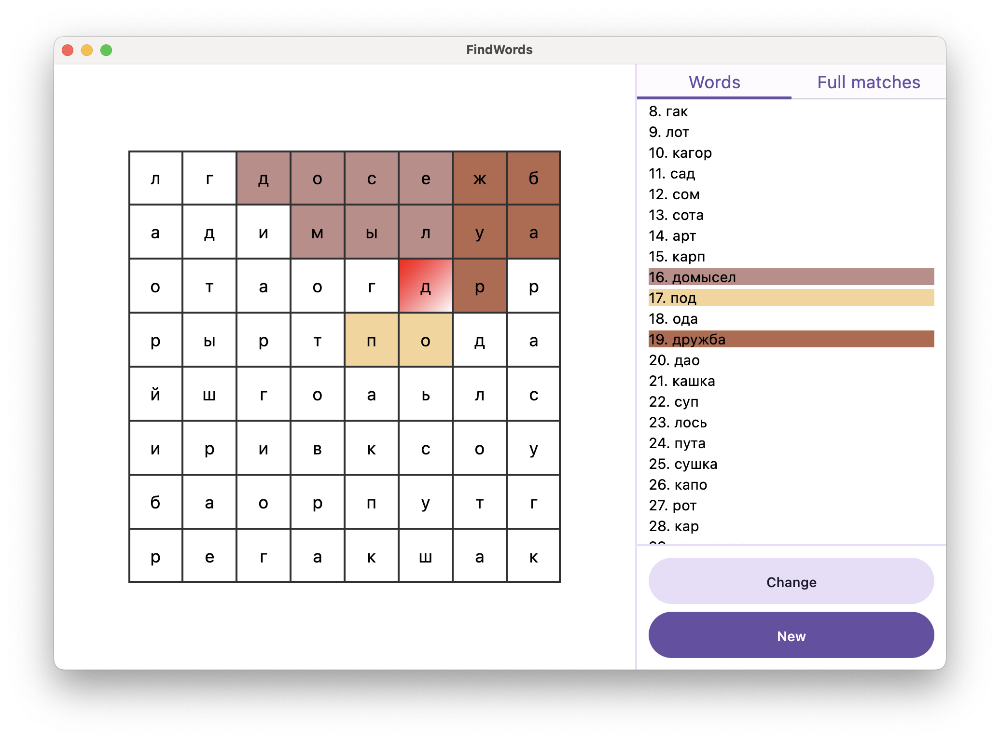
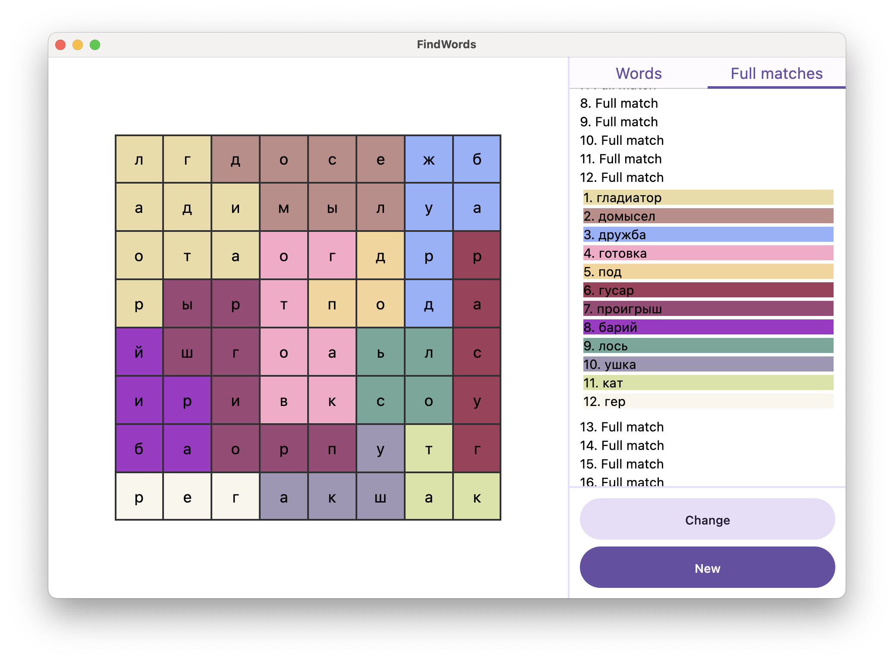

# FindWordsUi

FindWordsUi - GUI application for solving words puzzles is based
on the [FindWordsJ](https://github.com/EpicDima/FindWordsJ) library.

For the UI, the following were used [Decompose](https://github.com/arkivanov/Decompose)
and [Compose Multiplatform](https://github.com/JetBrains/compose-multiplatform)
with [Material 3](https://m3.material.io/).

## Screenshots

1. Enter screen with text:

```text
лгдосежб
адимылуа
отаогдрр
рыртпода
йшгоаьлс
иривксоу
баорпутг
регакшак
```

The parameters for finding a solution with a minimum word length of 3 letters
and a maximum of 15 letters are specified. The search for complete solutions is also enabled.



2. The screen where the results of the decision are expected.
  You can see 109 found words and 24 complete solutions to this puzzle.

  _The built-in dictionary is used for the solution._



3. The result of the decision. 3 words are selected,
  and the intersection of the words "под" and "дружба" can be seen on the letter "д".



4. The result of the decision. The complete solution of the puzzle number 12 has been selected.
  12 words of such a solution are highlighted in different colors in a grid of letters.


